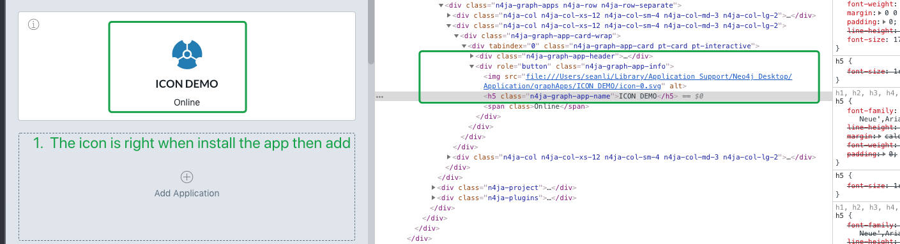
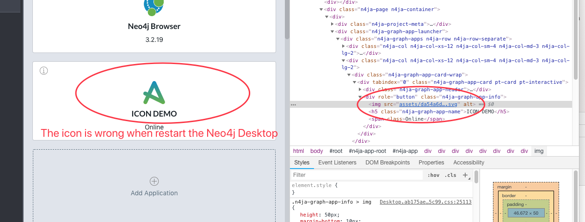

##Ne4j Desktop Online **Graph App** icon issues repeat steps.

####1. Install Graph Application (ICON DEMO)
Please use <http://neo4jdesktopiconissues.code4demo.com/> as **Graph App URL**, then add app **ICON DEMO**
Your will see right icon.

####2. Restart the **Neo4j Desktop** app. You will see the icon is not right now.
Please restart neo4j desktop app, your the **ICON DEMO**'s  icon change to neo4j default **Graph App** icon
